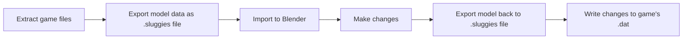

# Sluggies-dat-tools

This fork of the MSS-Dat-tools is laser focused on Mario Super Sluggers only and will probably not work with much else.
Goal is the export of original MSS 3D player models and subsequent re-import of edited models. For funny.

None of this would have been possible without the folks who created the tools and documentation for these games.
- LlamaTrauma for the [MSS-Dat-Tools](https://github.com/LlamaTrauma/MSS-dat-tools) which this is forked off.
- roeming for the [MSSB-Export-Models](https://github.com/roeming/MSSB-Export-Models)
- The [Mario Sluggers Model format documentation](https://thatsrightigame.com/sluggers/format_docs/)

And the helpful Sluggers community for always having an open ear and pointing me in the right directions.

## Requirements

- Dolphin Emulator https://dolphin-emu.org/
- US(!) copy of Mario Super Sluggers
- Python https://www.python.org/downloads/
- Collada ``pip install pycollada``
- **wimgt** (part of [Wiimms SZS Tools](https://szs.wiimm.de/download.html)) — must be on `PATH`; used to convert textures between TPL and PNG. No textures without this.
- Blender 4.2 or newer https://www.blender.org/download/
- Autism

I want to keep making the whole process easier in the future, so look out for updates.

## Workflow - Overall Concept

## Export  

1) clone or download this repository
2) Set up Dolphin & Game iso
3) Try running the game to make sure everything is prepped correctly
4) right click the Game -> properties -> Filesystem -> right click top node -> extract entire disc
5) from the extracted disc data, copy both "dt_na.dat" and "main.dol" to the folder \1_Input\
6) cmd ``` python export.py ```

This will extract the entire content into a new folder \2_Output_Models\\...  
It will contain all the player models, props and environment models. Everything is sorted into numbered folders, for example Tiny Kong + her Bat + her Glove is in folder "75". 

If you get texture-related errors, make sure you've added the wimgt tools bin folder (usually .\szs_v2_42a\bin\\) to your [PATH](https://www.youtube.com/watch?v=rWVaxSWvxUQ)

## Blender editing

1) install the included SluggiesBlenderAddon .zip file
2) File -> import -> Sluggers intermediate -> select one .sluggie file from the output folder
3) Edit mesh, according to the [Blender Guide](BlenderGuide.md)
4) File -> export -> Sluggers intermediate -> select the **same** file you imported earlier to export your changes to

Nothing is lost, the updated file will hold both original and edited mesh data for you.
Exporting to a .sluggies file will automatically put the file name on your clipboard for the next step

## Import

*The file name from the last step should still be in your clipboard unless you copied something else in the meantime.*
1) cmd ``` python patch.py [yourfilename.sluggie]```
2) a new folder 3_Output_Dat will appear, containing a patched dt_na.dat file
3) keep applying as many patches as you like, you can also specify mutliple file names
4) copy the finished dt_na.dat file back into the unpacked game folder, overwrite
5) start the unpacked game containing the patched dat file using Dolphin (we are not re-packaging it into an iso file for now, dolphin can run it just fine as is)
