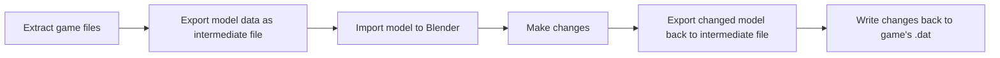

# Sluggies-dat-tools

This fork of the MSS-Dat-tools is laser focused on Mario Super Sluggers only and will probably not work with much else.
Goal is the export of original MSS 3D player models and subsequent re-import of edited models. For funny.

None of this would have been possible without the folks who created the tools and documentation for these games.
LlamaTrauma for the [MSS-Dat-Tools](https://github.com/LlamaTrauma/MSS-dat-tools) which this is forked off.
roeming for the [MSSB-Export-Models](https://github.com/roeming/MSSB-Export-Models)
The [Mario Sluggers Model format documentation](https://thatsrightigame.com/sluggers/format_docs/)

And the helpful Sluggers community for always having an open ear and pointing me in the right directions.

## requirements

- Dolphin Emulator https://dolphin-emu.org/
- US(!) copy of Mario Super Sluggers
- **wimgt** (part of [Wiimms SZS Tools](https://szs.wiimm.de/wimgt/) ) — must be on `PATH`; used to convert textures between TPL and PNG. No textures without this.
- Blender 4.2 or newer https://www.blender.org/download/
- Python https://www.python.org/downloads/
- Autism

## Workflow  
### Overall Concept



### Export  

1) Set up Dolphin & Game iso
2) Try running the game to make sure everything is prepped correctly
3) right click MSS -> properties -> Filesystem -> right click top node -> extract entire disc
4) clone or download this repository
5) from the extracted disc data, copy both "dt_na.dat" and "main.dol" to the folder \export_daes\input\
6) you can save some waiting time by setting dae and texture extraction toggles at the top of export.py to "False"
7) cmd 
```
cd export_daes
python export.py
```

This will extract the entire content into a new folder \output\\...  
It will contain all the player models, props and environment models. Everything is sorted into numbered folders, for example Tiny Kong + her Bat + her Glove is in folder "75". 

If you get texture-related errors, make sure you've added the wimgt tools bin folder (usually .\szs_v2_42a\bin\\) to your [PATH](https://www.youtube.com/watch?v=rWVaxSWvxUQ)

### Blender editing

1) install the addon .zip file from the BlenderAddon folder
2) File -> import -> Sluggers intermediate -> select one json file from the output folder
3) in edit mode, change the positions of vertices and/or edit the face normal vectors as desired
4) File -> export -> Sluggers intermediate -> select the **same** json file you imported earlier to export your changes to

Nothing is lost, the updated file will hold both original and edited mesh data for you.

- **This workflow currently does not support adding or removing vertices. It would lead to crashes later on when writing data back to the game.**
- currently, only manipulation of vert positions and face normals is supported. More is in the works. Please wait warmly (or contribute!).
- Materials, UVs and bone binding are also not getting touched at all.
- Do not rename models, the names contain information about where the mesh belongs.
- Do not remove the objects custom properties

### Import

**not yet functional, this readme part is a stub**

1) once you have edited your model in Blender, export it as . 
   (Blender 5.x and higher no longer support thus format! Use third party plugins or install an older version of blender, 4.5 and lower)
2) put the file in a new folder \import_model\somefoldername\
3) update path at the beginning of import.py to your new folder
4) sacrifice a goat to the machine god
5) cmd
``` 
cd import_model
python import_dae.py
```
5) ???
6) receive "out" file
7) ensure model does not overshoot original models length (how?)
8) integrate "out" contents into dt_na.dat