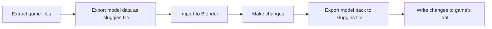

# Sluggies-dat-tools

## Portable Windows release

Download the latest packaged tools and Blender add-on from the
[Sluggies-dat-tools release site](https://jackharrhy.github.io/Sluggies-dat-tools/).
The portable release includes Python, the required Python packages, and
**wimgt** from Wiimms SZS Tools. Texture conversion works without a separate
install or changes to `PATH`.

This fork of the MSS-Dat-tools is laser-focused on Mario Super Sluggers only and will probably not work with much else.
Goal is the export of original MSS 3D player models and subsequent re-import of edited models. For funny.

None of this would have been possible without the folks who created the tools and documentation for these games.
- LlamaTrauma for the [MSS-Dat-Tools](https://github.com/LlamaTrauma/MSS-dat-tools) which this is forked off.
- roeming for the [MSSB-Export-Models](https://github.com/roeming/MSSB-Export-Models)
- The [Mario Sluggers Model format documentation](https://thatsrightigame.com/sluggers/format_docs/)
- pyinstaller portable windows setup by [jackharrhy](https://github.com/jackharrhy) 

And the helpful Sluggers community for always having an open ear and pointing me in the right directions.  
"Sluggie" is short for "SLUGGers IntermediatE format".


## Requirements (not needed when using portable release)

<details>
<summary><strong> Requirements & Setup </strong></summary>

- Dolphin Emulator https://dolphin-emu.org/
- US(!) copy of Mario Super Sluggers
- Python 3.12 or newer https://www.python.org/downloads/ (source checkout only)
- Numpy ``pip install numpy`` (source checkout only)
- Collada ``pip install pycollada`` (source checkout only)
- Pillow ``pip install Pillow`` (source checkout only)
- **wimgt** (source checkout only) — part of [Wiimms SZS Tools](https://szs.wiimm.de/download.html); used to convert textures between TPL and PNG. It is already bundled in the portable Windows release.
- Blender 4.2 or newer https://www.blender.org/download/
- Autism

### Source checkout: setting up wimgt on Windows

The portable release does this for you. If you are running the Python source
instead:

1. Download the **Cygwin64** ZIP from [Wiimms SZS Tools](https://szs.wiimm.de/download.html) and extract it somewhere permanent.
2. Open Windows Search, type **environment variables**, and select **Edit the environment variables for your account**.
3. Under **User variables**, select **Path**, choose **Edit**, then **New**.
4. Add the extracted tools' `bin` folder (for example, `C:\Tools\szs-v2.42a-r8989-cygwin64\bin`) and confirm each dialog.
5. Open a new Command Prompt and run `wimgt --version`. If it prints version information, setup is complete.

If you do not need textures, `--notex` skips PNG conversion and does not require
`wimgt`.

</details>

## Workflow - Overall Concept

```mermaid
flowchart LR
    A[Extract game files] --> B[Export model data as .sluggies file]
    B --> C[Import to Blender]
    C --> D[Make changes]
    D --> E[Export model back to .sluggies file]
    E --> F[Write changes to game's .dat]
```

All commands are to be used on the command line - enter "cmd" in file explorer's address bar to open a new terminal in the current folder.  

## Export  

1) Set up Dolphin & Game iso
2) Try running the game to make sure everything is prepped correctly
3) right click the Game -> properties -> Filesystem -> right click top node -> extract entire disc
5) from the extracted disc data, copy both "dt_na.dat" and "main.dol" (and optionally fst.bin) to the folder \1_Input\
6) cmd ```sluggies-dat-tools.exe --export --untangle``` (or, alternatively, just start the included batch file)

This will extract the entire content into a new folder \2_Output_Models\\...  
It will contain all the player models, props and environment models. Everything is sorted into numbered and approximately named folders.
With the "untangle" parameter, duplicate textures will be made unique. Their file names will change compared to "vanilla" Sluggers.
You can also use the option --notex to skip the rather slow png creation step. Removes the requirement for wimgt.


## Blender editing

1) install the included SluggiesIO_BlenderAddon_Vxxx.zip file
2) File -> import -> Sluggers intermediate -> select one .sluggie file from the output folder
3) Edit mesh, according to the [Blender Guide](BlenderGuide.md)
4) File -> export -> Sluggers intermediate -> select the **same** file you imported earlier to export your changes to

Nothing is lost, the updated file will hold both original and edited mesh data for you.
Exporting to a .sluggies file will automatically put the file name on your clipboard for the next step.

## Import

*The file name from the last step should still be in your clipboard unless you copied something else in the meantime.*
1) cmd ``` python start.py --patch myfilename```
2) a new folder 3_Output_Dat will appear, containing a patched dt_na.dat and main.dol file
3) keep applying as many patches as you like, you can also specify multiple file names
4) copy the finished dt_na.dat and main.dol files back into the unpacked game folder, overwriting the old ones
5) start the unpacked game containing the patched dat file using Dolphin (we are not re-packaging it into an iso file for now, Dolphin can run it just fine as is)

You can call patch.py with the option --unpatch to write the original model back to the dat.
Example: ``python patch.py --unpatch myfilename``

## Icon Reimport

After editing sheets in ``2_Output_Models/_ICONS/sheets (EDIT THESE)``, reimport with:

1) ``python start.py --patch-icons``
2) Patched output is written to ``3_Output_Dat/dt_na.dat``
3) A report is generated at ``2_Output_Models/_ICONS/metadata [META]/reimport_report.json``

Useful options:

- ``python start.py --patch-icons --dry-run`` validates and reports without writing bytes.
- ``python start.py --patch-icons --palette-only`` writes only page palettes.

## Icons for unused characters

1) insert your own front and side icon images into the templates in folder /1_Input/_Icons/
2) run python start.py --add-custom-icons
3) make sure the old gecko code to make unuseds selectable is active in dolphin
4) the 6 unused characters will now show the 12 injected images as front and side icons

## Development progress:
✅ .dae model & .png texture export (one-way)  
✅ SLUGGers IntermediatE (.sluggie) export  
✅ Blender Import/Export plugin  
✅ Vertex position editing  
✅ Vertex animation editing (shapekeys)  
✅ UV position editing  
✅ Icon Modding  
✅ Assign new Icons to unused characters  
✅ Make unused character textures independent  
❌ Armature editing  
❌ Hammerspace full-Model replacement  
❌ Animations
