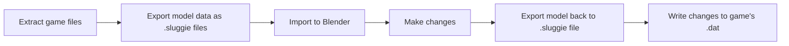

# Sluggies-dat-tools

## Portable Windows release

Download the latest packaged tools and Blender add-on from the
[Sluggies-dat-tools release site](https://jaws-git.github.io/Sluggies-dat-tools/).
The portable release includes Python, the required Python packages, and
**wimgt** from Wiimms SZS Tools. Texture conversion works without a separate
install or changes to `PATH`.

This fork of the MSS-Dat-tools is laser-focused on Mario Super Sluggers only and will probably not work with much else.
Goal is the export of original MSS 3D player models and subsequent re-import of edited models. For funny.

None of this would have been possible without the folks who created the tools and documentation for these games.
- LlamaTrauma for the [MSS-Dat-Tools](https://github.com/LlamaTrauma/MSS-dat-tools) which this is forked off.
- roeming for the [MSSB-Export-Models](https://github.com/roeming/MSSB-Export-Models)
- The [Mario Sluggers Model format documentation](https://thatsrightigame.com/sluggers/format_docs/)
- pyinstaller portable windows setup by [jackharrhy](https://github.com/jackharrhy) 

And the helpful Sluggers community for always having an open ear and pointing me in the right directions.  
"Sluggie" is short for "SLUGGers IntermediatE format".

## Requirements (not needed when using portable release)

<strong> Requirements & Setup </strong>

- Dolphin Emulator https://dolphin-emu.org/
- US(!) copy of Mario Super Sluggers
- Python 3.12 or newer https://www.python.org/downloads/ (source checkout only)
- Numpy ``pip install numpy`` (source checkout only)
- Pillow ``pip install Pillow`` (source checkout only)
- DearPyGui ``pip install dearpygui`` (source checkout only; used by the GUI)
- **wimgt** (source checkout only) — part of [Wiimms SZS Tools](https://szs.wiimm.de/download.html); used to convert textures between TPL and PNG. It is already bundled in the portable Windows release. No textures without this.
- Blender 4.2 or newer https://www.blender.org/download/
- Autism

### Source checkout: setting up wimgt on Windows

The portable release does this for you. If you are running the Python source
instead:

1. Download the **Cygwin64** ZIP from [Wiimms SZS Tools](https://szs.wiimm.de/download.html) and extract it somewhere permanent.
2. Open Windows Search, type **environment variables**, and select **Edit the environment variables for your account**.
3. Under **User variables**, select **Path**, choose **Edit**, then **New**.
4. Add the extracted tools' `bin` folder (for example, `C:\Tools\szs-v2.42a-r8989-cygwin64\bin`) and confirm each dialog.
5. Open a new Command Prompt and run `wimgt --version`. If it prints version information, setup is complete.

If you do not need textures, `--notex` skips PNG conversion and does not require
`wimgt`.

## Workflow - Overall Concept

```mermaid
flowchart LR
    A[Extract game files] --> B[Export model data as .sluggie files]
    B --> C[Import to Blender]
    C --> D[Make changes]
    D --> E[Export model back to .sluggie file]
    E --> F[Write changes to game's .dat]
```
All commands are to be used on the command line - enter "cmd" in file explorer's address bar to open a new terminal in the current folder.  

## Export  

1) Set up Dolphin & Game iso
2) Try running the game to make sure everything is prepped correctly
3) right click the Game -> properties -> Filesystem -> right click top node -> extract entire disc
4) from the extracted disc data, copy both "dt_na.dat" and "main.dol" (and optionally fst.bin) to the folder \1_Input\
5) start sluggies-dat-tools.exe for a GUI, use starttools.bat for a console menu, or call start.py directly on the CLI 
6) Use the Full Export or the focused export tabs to extract assets into the 2_Output_Models folder

## Blender editing

1) install the included SluggiesIO_BlenderAddon_Vxxx.zip file
2) File -> import -> Sluggers intermediate -> select one .sluggie file from the output folder
3) Edit model, according to the [Blender Guide](_docs/BlenderGuide.md)
4) File -> export -> Sluggers intermediate -> select the **same** file you imported earlier to export your changes to

Nothing is lost, the updated file will hold both original and edited mesh data for you.

## Patching the game

The gui now offers a grid view that lets you edit any slot of the roster individually and even expand the stock character table with new slots.
TODO: add CLI documentation

## Icon Editing
TODO: Update Icon guide
See [Icon Guide](_docs/IconGuide.md)

## Development progress:
✅ SLUGGers IntermediatE (.sluggie) export  
✅ .png texture & .glb model (optional, `--glb`) export  
✅ Blender Import/Export plugin  
✅ Vertex position editing  
✅ Vertex animation editing (shapekeys)  
✅ Full UV editing  
✅ Icon Modding & Assign new Icons to the unused characters  
✅ "Untangle" all textures so they can be replaced for one character only  
✅ Inject new player textures  
❌ Hammerspace full-Model replacement  
❌ Armature editing  
❌ Animations
